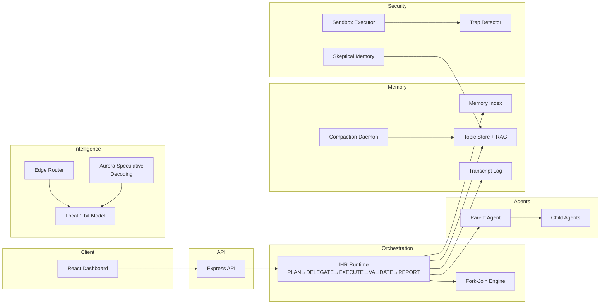

# NEXUS

> **Natural-language EXecution and Unified Scheduling framework** —
> A production-grade autonomous agent framework with hierarchical coordination,
> 3-layer memory, speculative decoding, edge intelligence, and enterprise security
> hardening. Built as a TypeScript/Python monorepo, ready to deploy on AWS.

## Architecture



## Quick Start

```bash
# Clone
git clone <repo-url> nexus && cd nexus

# Install dependencies
pnpm install

# Configure environment
cp .env.example .env
# Edit .env with your API keys (ANTHROPIC_API_KEY, OPENAI_API_KEY, etc.)

# Start all services
docker-compose up -d

# Or run in development mode
pnpm dev
```

**Services:**
- API: `http://localhost:3000`
- Dashboard: `http://localhost:5173`
- Compaction Worker: `http://localhost:8001`
- Aurora Controller: `http://localhost:8002`
- Edge Server: `http://localhost:8003`

## Monorepo Structure

```
/nexus
  /packages
    /core             — shared types, interfaces, config, constants
    /orchestrator     — IHR runtime, NLAH loader, fork-join, LLM client
    /memory           — 3-layer memory (index, topics, transcripts)
    /agents           — parent + child agent base classes
    /edge             — edge router, ULTRAPLAN bridge, local model server
    /speculative      — Aurora speculative decoding controller
    /billing          — hybrid billing (seats + usage + Stripe)
    /security         — skeptical memory, sandbox executor, trap detector
    /daemon           — KAIROS background daemon
    /api              — Express REST API (15 endpoints)
    /ui               — React + Vite + Tailwind dashboard
  /infra              — Pulumi IaC (AWS ECS, S3, DynamoDB, SQS)
  /nlah               — NLAH SOP markdown files
  /docs               — Architecture, security, billing docs
  /scripts            — Dev utilities
```

## Key Features

- **5-stage execution pipeline**: PLAN → DELEGATE → EXECUTE → VALIDATE → REPORT
- **Provider-agnostic LLM layer**: Anthropic, OpenAI, and local edge models
- **Fork-join parallelism**: Parallel branch execution with configurable scoring
- **3-layer memory**: Index → Topics → Transcripts with RAG retrieval
- **Speculative decoding**: Draft model proposes, target model verifies, with LoRA fine-tuning
- **Edge intelligence**: Classify tasks as EDGE/FRONTIER, route to appropriate model
- **Security hardening**: Sandboxed execution, 13+ trap patterns, memory verification
- **Hybrid billing**: Seat licenses + usage metering + Stripe invoicing
- **Full observability**: Event bus, SSE streaming, audit logging

## Documentation

- [Architecture](docs/ARCHITECTURE.md) — System design, Mermaid diagrams, design decisions
- [Contributing](docs/CONTRIBUTING.md) — Setup, development workflow, code style
- [Security](docs/SECURITY.md) — Threat model, sandbox policy, trap taxonomy
- [Billing](docs/BILLING.md) — Pricing model, usage schema, Stripe integration

## Tech Stack

| Layer | Technology |
|-------|-----------|
| Orchestration | TypeScript, Node.js 20+ |
| ML Services | Python 3.11+, FastAPI, llama.cpp |
| API | Express, Zod, JWT, SSE |
| UI | React 18, Vite, Tailwind CSS, Recharts |
| Infrastructure | Pulumi, AWS (ECS, S3, DynamoDB, SQS) |
| Testing | Vitest (TS), Pytest (Python) |
| Containerization | Docker, docker-compose |
| Package Manager | pnpm workspaces + Turborepo |

## License

MIT
