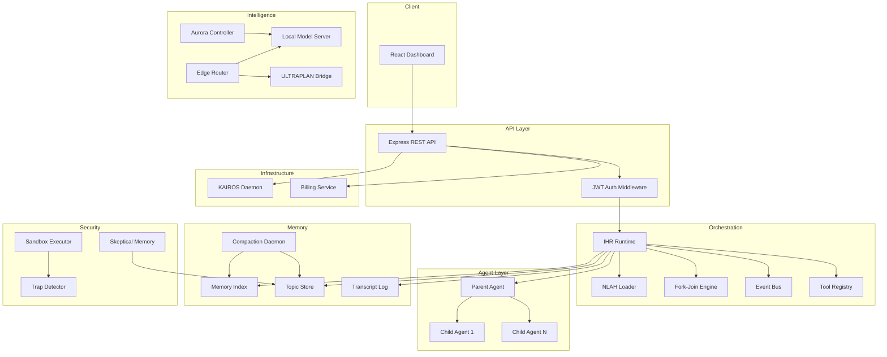
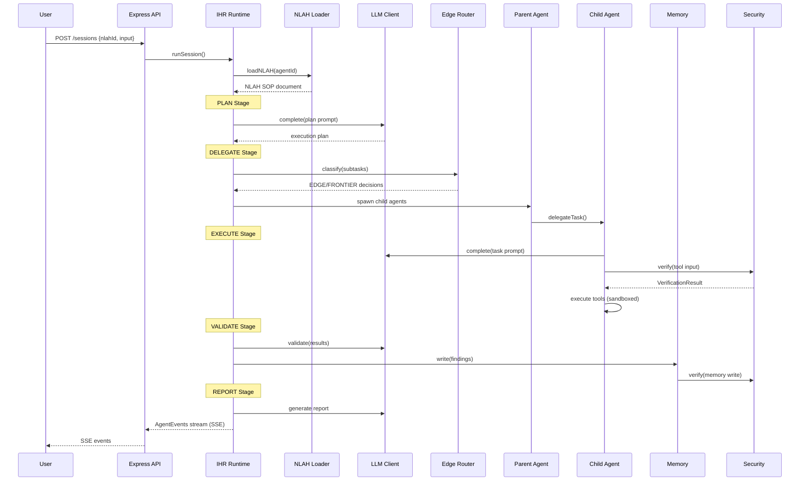

# NEXUS Architecture

## System Overview

NEXUS (Natural-language EXecution and Unified Scheduling) is an autonomous agent framework
built as a TypeScript/Python monorepo. It provides a complete infrastructure for building,
deploying, and monitoring AI agents with hierarchical coordination, memory management,
security hardening, and commercial billing.

## Component Diagram

## Session Lifecycle Sequence

## Package Architecture

| Package | Language | Purpose |
|---------|----------|---------|
| `@nexus/core` | TypeScript | Shared types, interfaces, config, constants |
| `@nexus/orchestrator` | TypeScript | IHR runtime, NLAH loader, fork-join, LLM client |
| `@nexus/memory` | TypeScript + Python | 3-layer memory (index, topics, transcripts) + compaction daemon |
| `@nexus/agents` | TypeScript | Parent/child agent base classes |
| `@nexus/edge` | TypeScript + Python | Edge router, ULTRAPLAN bridge, local model server |
| `@nexus/speculative` | Python | Aurora speculative decoding controller |
| `@nexus/security` | TypeScript | Skeptical memory, sandbox executor, trap detector |
| `@nexus/daemon` | TypeScript | KAIROS background daemon with subscriptions |
| `@nexus/billing` | TypeScript | Hybrid billing (seats + usage + Stripe) |
| `@nexus/api` | TypeScript | Express REST API (15 endpoints) |
| `@nexus/ui` | TypeScript/React | Vite + Tailwind dashboard (6 views) |
| `infra` | TypeScript | Pulumi IaC (AWS ECS, S3, DynamoDB, SQS) |

## Key Design Decisions

1. **Provider-agnostic LLM layer**: Supports Anthropic, OpenAI, and local edge models via a unified `LLMClientInterface`
2. **Result<T, E> everywhere**: All fallible operations use `neverthrow` Result types — no uncaught exceptions in business logic
3. **Strict parent/child boundary**: ChildAgents have no ability to call other ChildAgents — enforced architecturally
4. **Memory-first persistence**: All state flows through the 3-layer memory system with verification before commit
5. **Security by default**: All tool executions sandboxed, all memory writes verified, 13+ trap patterns detected automatically
